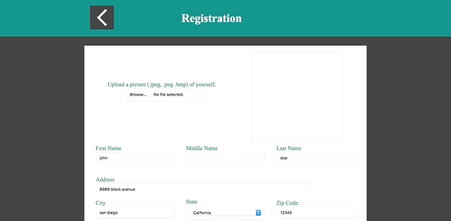
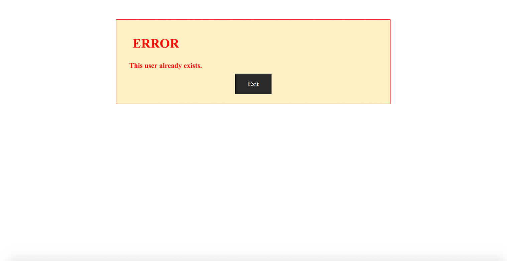
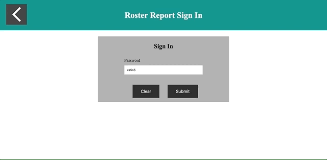

# CS545 Project 3 - Marathon (Server-side)
Details about this project are explained on my website. Please visit my [Portfolio](https://thucnguyen95.github.io/Portfolio/web_applications/CS545/project3_details.html)

<!-- Follow this [link](http://jadran.sdsu.edu/~jadrn041/proj3/index.html) to view the project. -->

Here is a preview of what the website looks like.

## Validation on Server
Validation that occurs in PHP on the server, in the case that JS is disabled.

## Duplicate Error
If there was an error in uploading the runner's image, this page would be outputted.

## Roster Report
Preview of how logging in successfully will generate the Roster Report.

