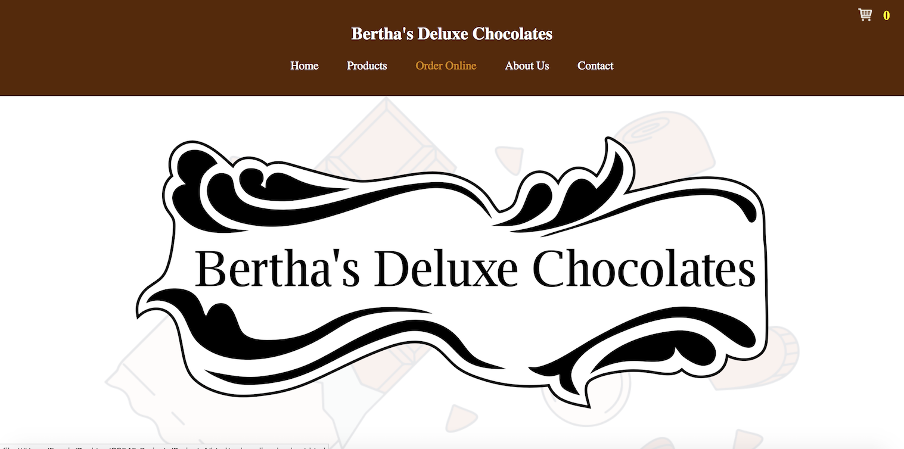

# CS545 - Project 4 - Bertha's Deluxe Chocolates
**Note**: This project does not display the full functionality of the website because I currently do not have hosting so the scripts cannot be run (I was also unable to take gifs and images of parts of the website, such as adding an item to the cart, checking out, entering in payment information, and placing the order). Furthermore, for security reasons, the host, port number, database, username, and password are omitted so connecting to the database that I used is disabled.

Details about this project are explained on my website. Please visit my [Portfolio](https://ennoiamai.github.io/Portfolio/web_applications/CS545/project4_details.html).

<!-- Follow this [link](http://jadran.sdsu.edu/~jadrn041/proj3/index.html) to view the project. -->

Here is a preview of what the website looks like. 

