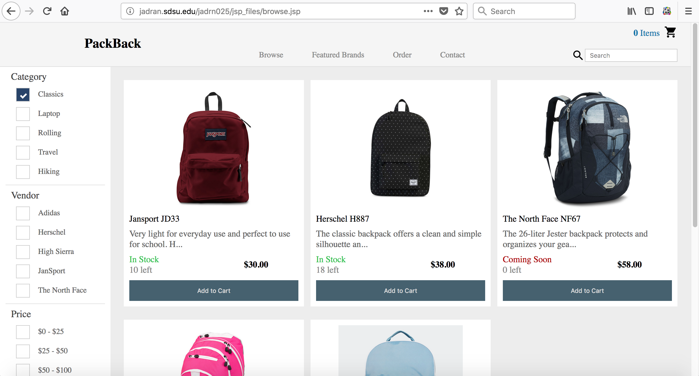
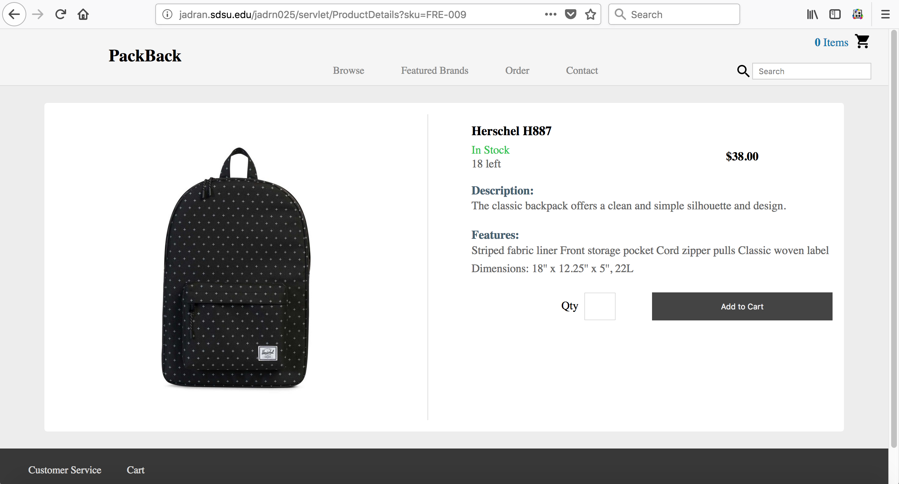
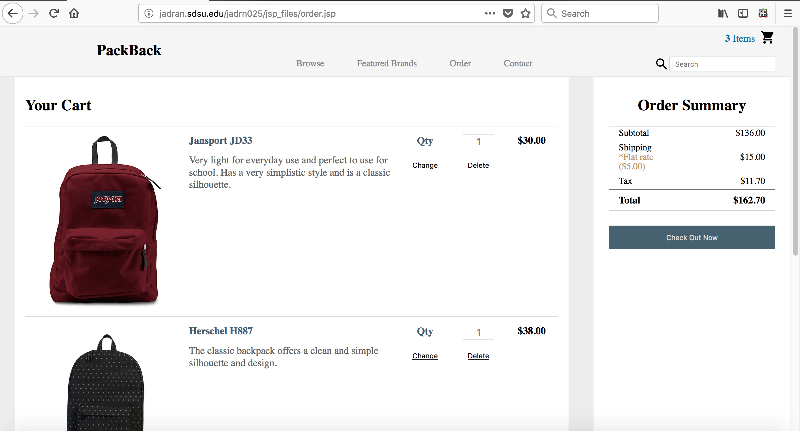
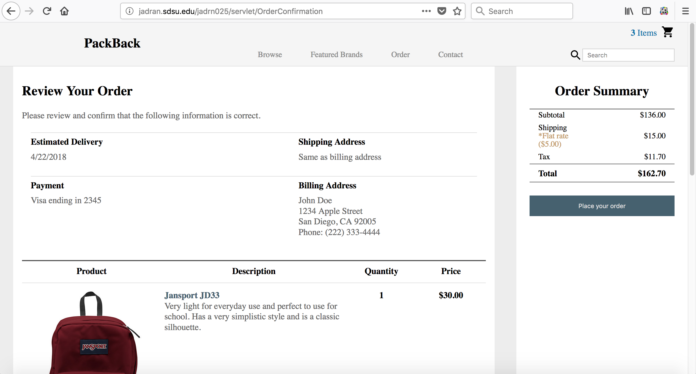
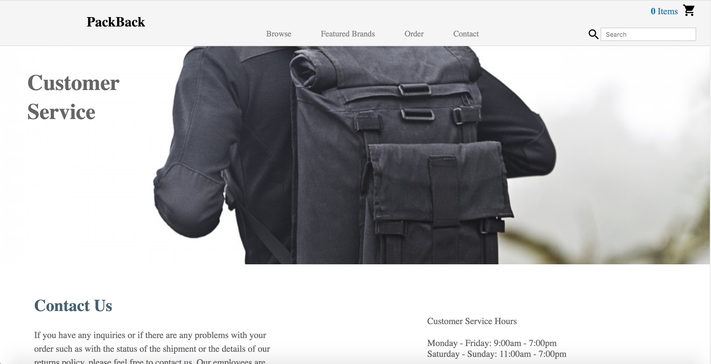
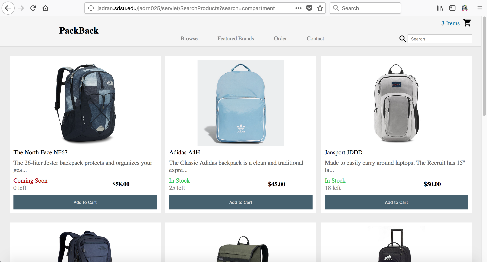

# CS645 - Project 2 - Packback (Java Servlets and Java Server Pages)

**Note**: For security purposes, the connectionURL was deleted from DBHelper.java, and thus a connection will not be
          made to the database that I connected to. Also, it should be noted that the files under WEB-INF, in an
          actual commercial product, would be placed under WEB-INF/classes and the files under protected_jsp would
          placed under WEB-INF/jsp. The folder here on Github only shows the relevant files that I useed for Java 
          Web Services.
          
**Datbase Images**: The images of the products were on the jadran server under my account for project 1. This is because
                    project 2 was a continuation of project 1 except that it dealt with the client side, the website used to
                    purchase the products, and essentially the UI.

Details about this project are explained on my website. Please visit my [Portfolio](https://ennoiamai.github.io/Portfolio/web_applications/CS645/project2_details.html).

Here is a preview of what the website looks like.

## Home Page

## Browse Page

## Product Details Page

## Featured Brands Page

## Order Page

## Checkout Page (Payment)

## Order Confirmation Page (Place Order)

## Contact Page

## Search Page

