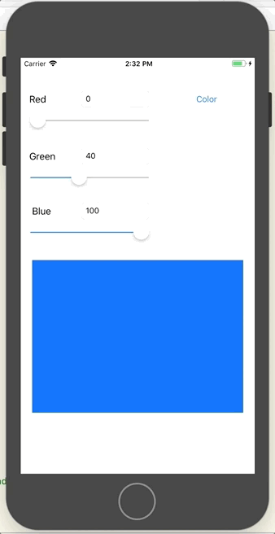
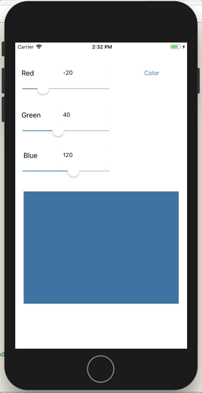

# CS646 Assignment 3 - Color View and Slider

Details about this assignment are explained on my website. Please visit my [Portfolio](https://ennoiamai.github.io/Portfolio/mobile_applications/CS646/assignment3_details.html).

Here is a preview of what the app looks like.

## Sliders to change the color view

## Input that are out of range

