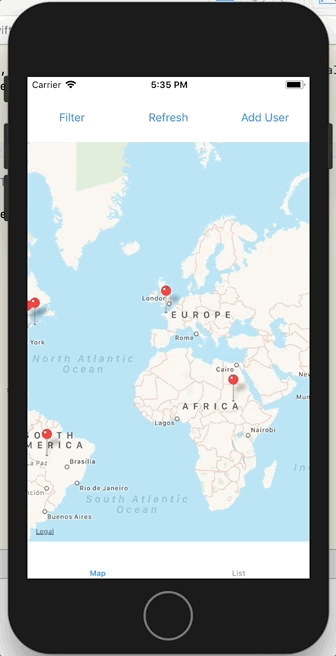

# CS646 Assignment 5 - SDSU Hometown Locations (Networks)

Details about this assignment are explained on my website. Please visit my [Portfolio](https://ennoiamai.github.io/Portfolio/mobile_applications/CS646/assignment5_details.html).

Here is a preview of what the app looks like.

## Retrieving students' hometown location and displaying them on MapView

## Filtering locations on MapView

